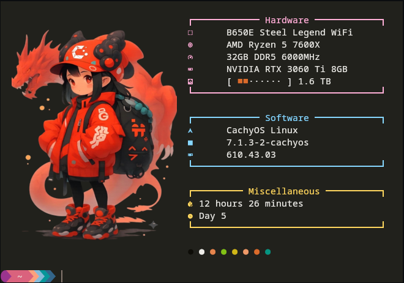
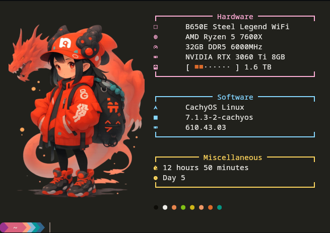

# Fastfetch Config

A clean, categorized fastfetch config with a box-drawn layout.

<table>
  <tr>
    <td><b>CachyOS</b><br></td>
    <td><b>Nobara</b><br></td>
  </tr>
</table>

## Install

### Download only (~/Downloads)

```bash
git clone https://github.com/Goodborn/fastfetchkonfig.git ~/Downloads/fastfetch
```

### Download and install directly

> **Warning:** This will overwrite your existing `config.jsonc`. Back up your current config first if you want to keep it.

```bash
git clone https://github.com/Goodborn/fastfetchkonfig.git /tmp/fastfetch && cp /tmp/fastfetch/config.jsonc ~/.config/fastfetch/config.jsonc && cp -r /tmp/fastfetch/images/ ~/.config/fastfetch/images/ && cp -r /tmp/fastfetch/ascii/ ~/.config/fastfetch/ascii/ && rm -rf /tmp/fastfetch
```

## Customize

All editable values are in `config.jsonc`. Everything else is auto-detected.

| What | Line | Default | Change to |
|------|------|---------|-----------|
| Logo image | `3` | `~/.config/fastfetch/images/cachy.png` | Your logo path |
| RAM display | `59` | `{ram-total} GB` | `{ram-used} GB / {ram-total} GB` |
| GPU display | `65` | `{gpu-name}` | `{gpu-vendor} {gpu-name}` |
| Disks shown | `74` | `"/"` | `"/:/mnt/Data:/mnt/Backup"` |
| GPU driver | `103` | `glxinfo ...` | `nvidia-smi ...` for NVIDIA |

```jsonc
// Logo — point to your distro image or an ASCII art file
"source": "~/.config/fastfetch/images/cachy.png"

// RAM — swap between total, used, or percentage
"format": "{ram-total} GB"

// GPU — auto-detected, no need to hardcode
"format": "{gpu-name}"

// Disks — colon-separated list of mount points
"folders": "/:/mnt/Backup"

// GPU driver — glxinfo (all), nvidia-smi (NVIDIA), or remove the module entirely
"text": "glxinfo 2>/dev/null | grep 'OpenGL version' | sed 's/.*: //'"
```

Drop your logo PNG into `images/`, or swap the logo source to an ASCII art file from `ascii/`.

## Requirements

- [fastfetch](https://github.com/fastfetch-cli/fastfetch)
- A [Nerd Font](https://www.nerdfonts.com/) for the icons
- Kitty, Alacritty, or another terminal that supports image rendering (for PNG logos)
